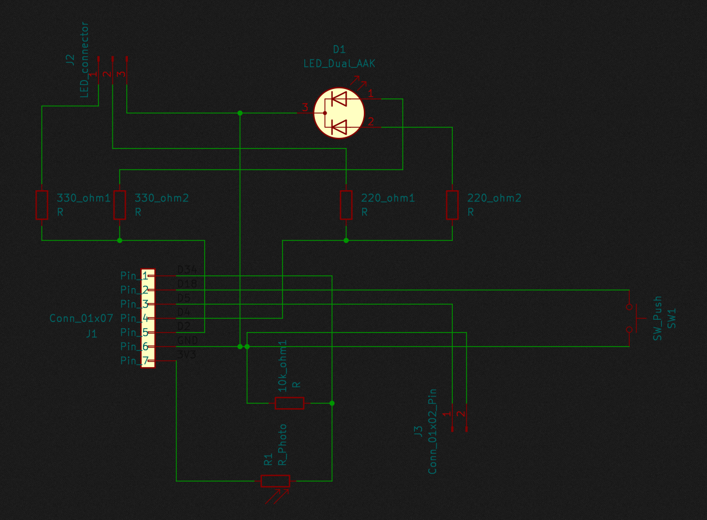
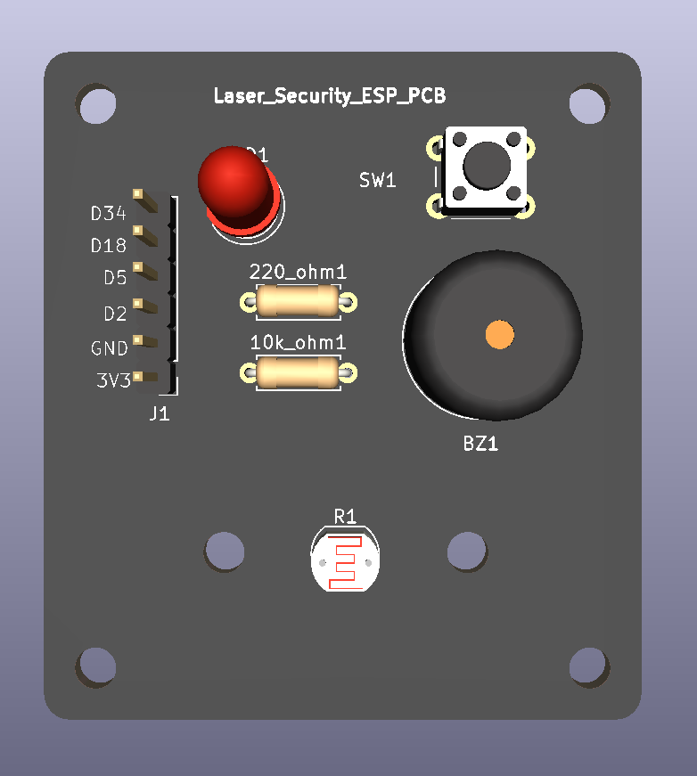
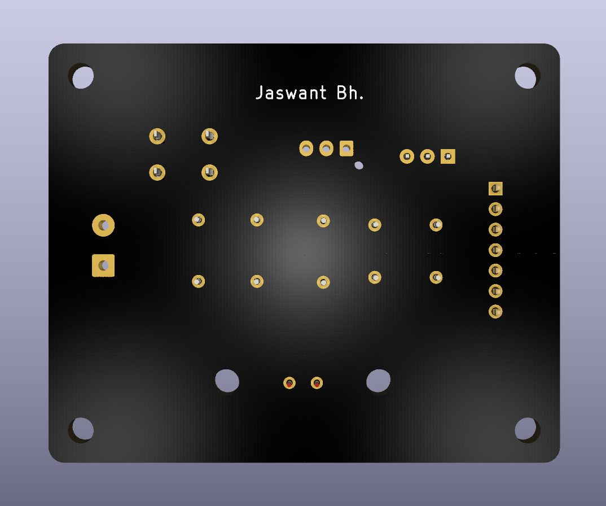
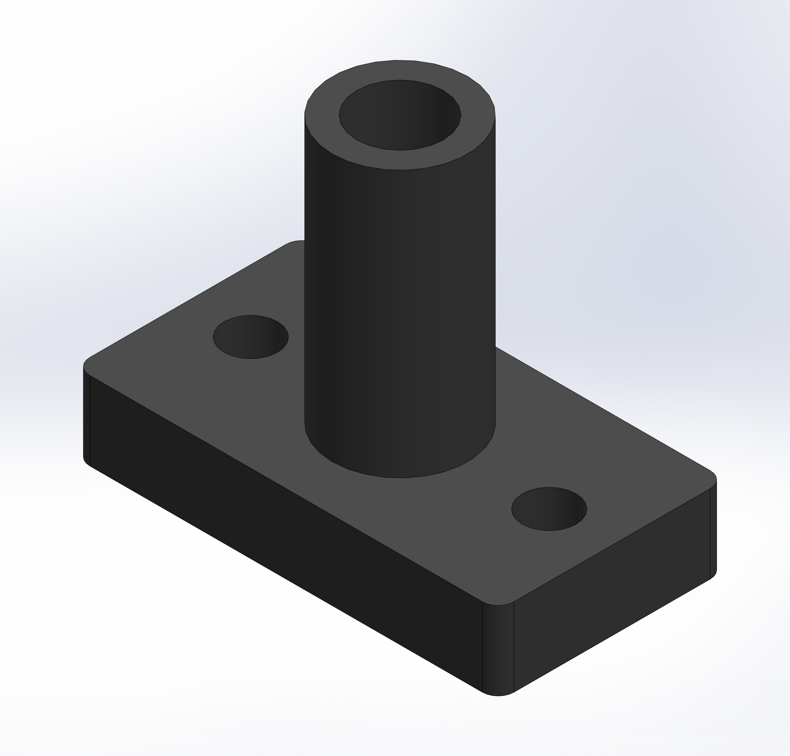
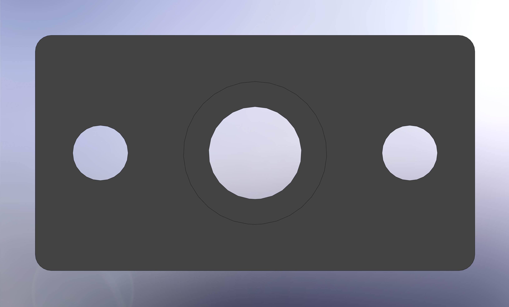
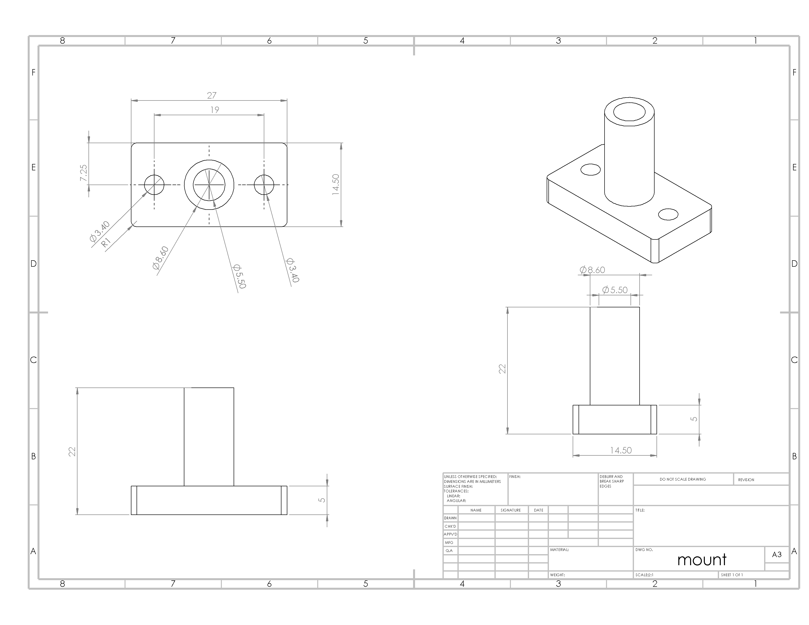
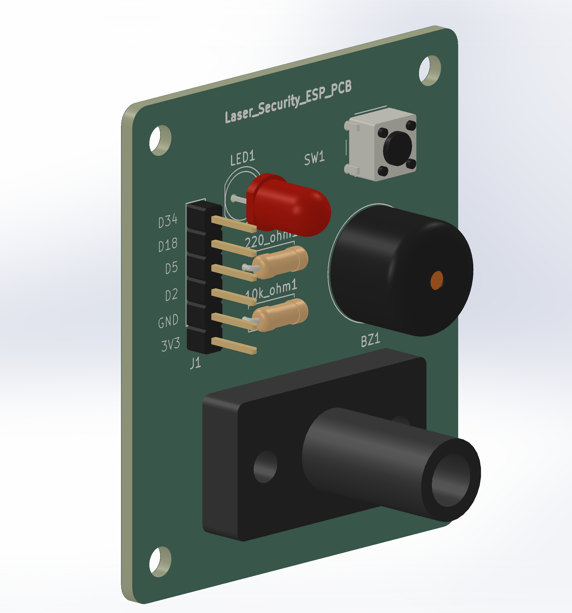
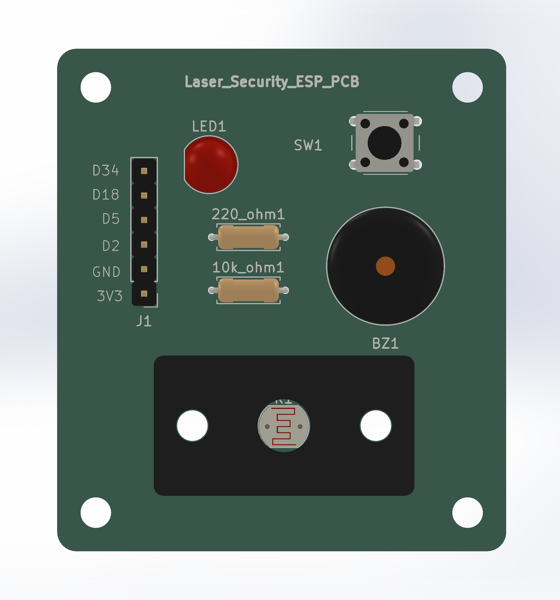
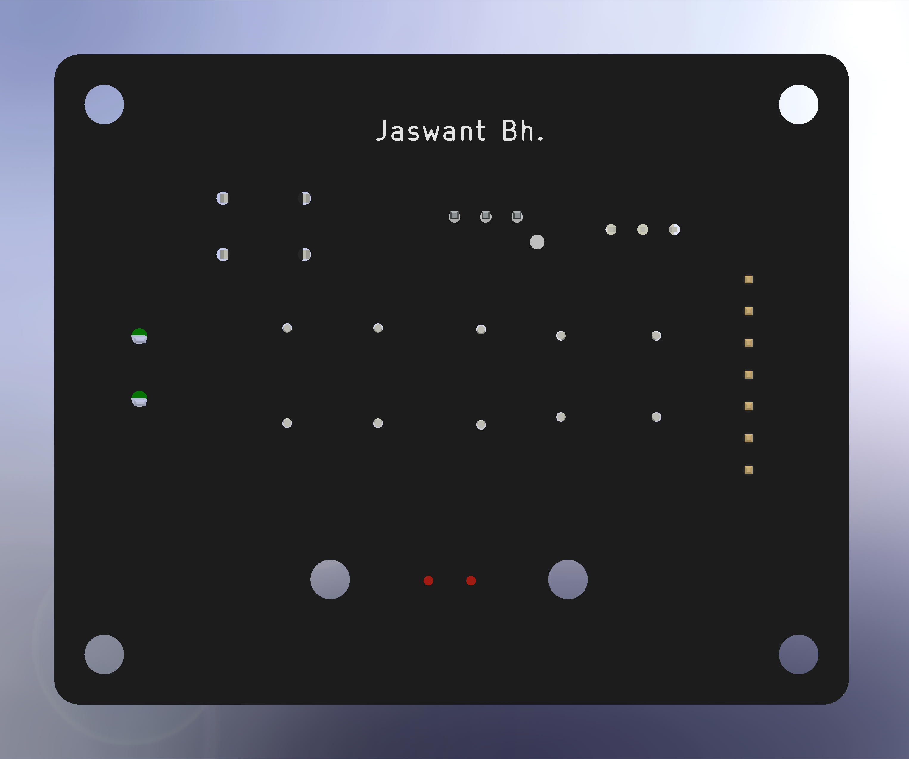

<div align="center">
  

  <br><br>


<br><br>

# 🛡️ ESP32 Multi-Bounce Laser Security System
<!-- Badges Section -->
<p align="center">
  
  
  
  
  
  
</p>


<h4>
    <a href="#demo">Demo</a>&nbsp;&nbsp;&nbsp;&nbsp;•&nbsp;&nbsp;&nbsp;&nbsp;
    <a href="#hardware">Hardware Design</a>&nbsp;&nbsp;&nbsp;&nbsp;•&nbsp;&nbsp;&nbsp;&nbsp;
    <a href="#mechanical">Mechanical Shroud</a>&nbsp;&nbsp;&nbsp;&nbsp;•&nbsp;&nbsp;&nbsp;&nbsp;
    <a href="#firmware">Firmware & Calibration</a>&nbsp;&nbsp;&nbsp;&nbsp;•&nbsp;&nbsp;&nbsp;&nbsp;
    <a href="https://github.com/JaswantBhartiya" target="_blank">Contact</a>
</h4>
</div>

<br>

A professional, budget-friendly embedded security system built around a custom PCB and the ESP32 DevKit V1. This project utilizes an optical multi-bounce laser path bounced across real glass mirrors to form a tight perimeter grid, monitored dynamically by an onboard Light Dependent Resistor (LDR).

<br><br>

---

## <span id="demo">🚀</span> Key Features & Demo

* **Wireless Perimeter Deployment:** Optimized for practical room scaling. The laser transmitter operates on its own isolated power rail across the room, completely eliminating the need to run long, messy signal lines back to the main controller.
* **Multi-Bounce Optical Path:** Engineered to utilize low-cost, focusable red ($650\text{nm}$) or green ($532\text{nm}$) dot laser diodes. The concentrated beam cleanly sustains 4 to 5 glass mirror reflections across a room while maintaining a sharp focal point on the sensor.
* **Smart Ambient Calibration:** On boot, the system automatically samples the room's ambient light level to calculate a dynamic trigger threshold. This ensures highly reliable tripwire detection during both bright daylight and dark nights without manual recalibration.
* **Dual-State Status Indicators:** Utilizes an integrated Red-Green (RG) LED array—mirrored across both an onboard indicator (`D1`) and an external expansion header (`J1`)—providing instant visual feedback (**Green** for Armed, **Red** for Tripped).
* **Hardware Interruption Reset:** Employs a debounced hardware polling engine on `GPIO 18`. Pressing the onboard tactile button (`SW1`) instantly silences the active buzzer, flushes the alarm registers, and re-arms the perimeter grid.

<br>

---

## <span id="hardware">🛠️</span> Hardware Design

### System Schematic
The circuit diagram maps out the ESP32 interface, sensor voltage dividers, and laser control lines for low-noise operation.



<br>

### 📐 Electronics Layout (Raw KiCad PCB)
The custom board features a compact form factor, dedicated mounting holes, and clear silkscreen labeling.

| Front Layout | Back Layout |
| :---: | :---: |
|  |  |

<br>

### <span id="mechanical"></span>⚙️ Standalone Mechanical Mount
To achieve complete optical isolation and filter out ambient environmental light, a custom-molded mounting shroud was engineered.
<details> 
<summary><b>Click to Expand | Standalone Shroud Views</b></summary>

<br>

| Isometric View | Front View | Back View |
| :---: | :---: | :---: |
|  |  |  |

#### 📐 Engineering Dimensions & Tolerances


**Design Specifications:**

* **Material:** Matte/Satin Dark Grey PLA (To absorb stray internal reflections)
* **Internal Diameter:** Uniform 5.5mm corridor (Provides a 0.5mm clearance cushion for hand-soldered LDR play and FDM printing shrinkage)
* **Fasteners:** Dual M3 clearance holes for flush mounting.

</details>

<br>

👉 **[Click here to view the interactive 3D Mount Model Natively on GitHub](./production/3d_printing/mount.STL)**

<br>

### 🤝 Fully Integrated Assembly
The combined views show the mechanical shroud assembly bolted directly onto the electronic control circuit board.

<div align="center">
       
</div>

<br>
       
| Assembly Top View | Assembly Solder Side View |
| :---: | :---: |
|  |  |
<br>

---

## 📂 Repository Structure
``` yaml
      esp32-laser-security/
      ├── src/                             # 💻 Firmware Source Code (PlatformIO)
      │   ├── main.cpp                     #   └── Main security system logic
      │   └── testing/                     #   └── Isolated hardware testing scripts
      │       └── laser-connected-esp.cpp
      │
      ├── esp32-laser-security-pcb/        # 🛠️ KiCad Hardware Design Files
      │   ├── *.kicad_sch                  #   └── Circuit schematic
      │   └── *.kicad_pcb                  #   └── PCB routing layout
      │
      ├── production/                      # 📦 Manufacturing & 3D Printing Files
      │   ├── gerbers/                     #   └── PCB manufacturing files (Gerbers)
      │   ├── 3d_printing/                 #   └── 3D-printable mount shroud (.STL / .3MF)
      │   └── step_models/                 #   └── 3D CAD assembly model (.STEP)
      │
      ├── assets/                          # 🖼️ Documentation Media
      │   ├── circuit_schematic.png        #   └── Circuit diagram for README
      │   ├── pcb_raw_*.png/jpg            #   └── 3D images of unmounted PCB
      │   ├── mount_*.jpg                  #   └── 3D images of standalone plastic mount
      │   └── pcb_assembled_*.jpg          #   └── Photos of the final assembly
      │
      ├── platformio.ini                   # ⚙️ Project configuration & libraries
      └── README.md                        # 📖 Main project documentation guide
```
<br>

---

## 🛠️ Hardware Requirements

| Component | Quantity | Purpose |
| :--- | :--- | :--- |
| **ESP32 DevKit V1 Board** | 1 | Central processing unit & real-time monitoring engine |
| **SYD1230 650nm 5mW Red Laser Module** | 1 | Focusable transmitter node optimized for budget-friendly bouncing |
| **Light Dependent Resistor (LDR)** | 1 | High-sensitivity optical receiver |
| **Active Piezo Buzzer** | 1 | High-decibel audible dual-frequency warning siren |
| **First-Surface Mirrors / HDD Platters** | 2–4 | Zero-ghosting high-reflectivity corner reflection nodes |
| **Metal Film Resistor (10 kΩ)** | 1 | Pull-down resistor for the analog voltage divider circuit |
| **Metal Film Resistor (330 Ω)** | 2 | Current-limiting protection resistors (e.g., for status LEDs) |
| **Metal Film Resistor (220 Ω)** | 2 | Current-limiting protection resistors (e.g., for buzzer power constraints) |
| **6x6x5mm Tactile Push Button Switch** | 1 | PCB-mount tactile switch for instant manual system reset or calibration |
| **7×1 Pin Male Berg Header (Straight, 10mm Height, 2.54mm Pitch)** | 1 | Breakout interface connector for peripheral GPIO programming/debugging pins |
| **XY126V-5.0-2P Green Screw Terminal Block (5mm Pitch, Through Hole)** | 1 | XINLAIYA 10A 300V power connector with wire protection for external main DC input |
| **3 Pin JST XH 2.5mm Top Entry Header (Straight Male & Female Pair)** | 1 | Polarity-keyed locking connector for secure LDR receiver wire routing |
| **Socket Head Cap Screw (M3x12)** | 2 | High-strength mechanical fasteners for enclosure or PCB corner mounting |
| **M3 Stainless Steel Hex Nut** | 2 | Matching rust-resistant hexagonal nuts to secure the M3 mounting screws safely |

<br>

---

## 🔌 Circuit Topology & Wiring

To achieve a clean optical baseline and prevent room lighting from flooding the sensor, the LDR must be housed inside an opaque, dark isolation tube pointed directly down the incoming laser path.

### Central Control Unit Pinout Mapping

```text
      +-----------------------------------------------------------------+
      |                         ESP32 DEVKIT V1                         |
      +-----------------------------------------------------------------+
        | GPIO 34 (ADC) | <-------> Pin 1: LDR  (R1 Sensor Output Node)
        | GPIO 18       | <-------- Pin 2: RST  (Reset Push Button SW1)
        | GPIO 5        | --------> Pin 3: BUZZ (External Buzzer J3)
        | GPIO 19*      | --------> Pin 4: GRN  (Green LED Control Rail)
        | GPIO 21*      | --------> Pin 5: RED  (Red LED Control Rail)
        | GND           | --------> Pin 6: GND  (Common System Ground)
        | 3V3           | --------> Pin 7: 3V3  (System Power Input)

```
``` text
        +-----------------------------------------------------------------------------------+
        |                            EXTERNAL COMPONENT CONNECTIONS                         |
        +-----------------------------------------------------------------------------------+
        |                                                                                   |
        |  [ PCB Header J1 ] --------------------> Connects to EXTERNAL RG LED              |
        |     (EXT. RG LED)                         - Pin R: Red Indicator Anode            |
        |                                           - Pin G: Green Indicator Anode          |
        |                                           - Pin -: Common Ground Rail             |
        |                                                                                   |
        |  [ PCB Header J3 ] --------------------> Connects to EXTERNAL ACTIVE BUZZER       |
        |     (EXT. BUZZER)                         - Pin +: Positive Audio Signal Input    |
        |                                           - Pin -: Negative Ground Return         |
        |                                                                                   |
        +-----------------------------------------------------------------------------------+

```


### 3.3V Safe Voltage Divider Layout

```text
3V3 Rail -----[ LDR ]-----+-----> GPIO 34 (Analog Read Input)
                          |
                     [ 10kΩ Resistor ]
                          |
                         GND Rail
```
_Note: Powering the LDR network from the 3V3 rail protects the ESP32's 12-bit ADC pins from 5V over-voltage degradation._

<br>

## 💻 Software Configuration & Installation

This project is built using PlatformIO IDE inside VS Code for robust environment management and smaller, compiled binary footprints.
### Project Environment Configuration (platformio.ini)
```Ini, TOML

[env:esp32dev]
platform = espressif32
board = esp32dev
framework = arduino
monitor_speed = 115200

lib_deps =
    bblanchon/ArduinoJson @ ^7.0.0
```
### Deployment Instructions

1. Clone this repository to your local workspace:
    ```Bash
    git clone https://github.com/JaswantBhartiya/esp32-laser-security.git
    ```
    
2. Open the project folder directly inside **Visual Studio Code** with the **PlatformIO** extension active.

3. Align your external laser node across your mirror grid so it hits the center of the LDR tube.

4. Click the **PlatformIO**: **Upload** arrow icon on the bottom status bar (or press (`Ctrl + Alt + U`) to compile and flash the firmware.

5. Open the **Serial Monitor** (`Ctrl + Alt + M`) at `115200` baud to watch the system run its initial calibration profiling.
<br><br>

## ⚙️ How System States Work
```text
       +------------------+
       | STATE_CALIBRATING| <-------- On Boot / User Reset
       +------------------+
                 |
                 v (Captures Max Beam Intensity & Computes Median)
       +------------------+
  +--->|   STATE_ARMED    |
  |    +------------------+
  |              |
  |              v (LDR Reading drops below threshold for >50ms)
  |    +------------------+
  |    |  STATE_BREACHED  |
  |    +------------------+
  |              |
  +--------------+ (GPIO 18 Shorted to GND / Reset Wired Activated)
```

1. **Optical Profiling (Boot)**: The system samples the active beam alignment over a 3-second window to capture maximum intensity. It then models a mathematical median trigger threshold exactly halfway between the direct laser strength and background ambient lighting.

2. **Active Guard Mode**: The ESP32 continuously polls the internal 12-bit Analog-to-Digital Converter (`ADC1`). A software debounce filter requires the beam to be fully broken for more than `50ms` to prevent false alarms from flying bugs or floating dust.

3. **Breached Alert Loop**: When triggered, the system shifts into a high-priority alert state. The ESP32 generates a non-blocking dual-tone police siren sweep pattern (`800Hz` to `1300Hz`) using microseconds delay-toggling on `GPIO 5`.

4. **Hardware Disarm**: While driving the siren frequencies, the controller actively checks `GPIO 18`. The exact microsecond your reset button is pressed (or your jumper wires touch), the system immediately mutes the buzzer, runs a fresh optical room calibration, and shifts smoothly back to active protection mode.

<br>

## ⚙️ Calibration & Environment Tuning

The system features an automated **Optical Profiling Engine** on boot. To get the highest accuracy and avoid false alarms from ambient sunlight or room lamps, use the following deployment steps:


### 🛠️ Step-by-Step Alignment Guide
1. **Physical Alignment:** Position your mirrors and aim your laser dot until it lands cleanly inside the center entry corridor of the 3D-printed LDR shroud.
2. **Boot Calibration:** Power on or reset the ESP32 via `SW1`. Keep the laser path completely unobstructed for the first **3 seconds**. 
3. **Threshold Calculation:** The firmware samples the peak light intensity and dynamically sets a software trigger threshold using a mathematical median:
   
   $$\text{Threshold} = \frac{\text{Laser Light Intensity} + \text{Ambient Background Light}}{2}$$

4. **Verification:** Open your PlatformIO Serial Monitor (`115200` baud). You will see the baseline values printed out. Block the beam with your hand to verify the system instantly transitions to `STATE_BREACHED`.


### 🔍 Ambient Light Troubleshooting

If you are deploying the system in environments with highly unpredictable lighting (e.g., near windows with moving sunlight), use this quick matrix to tune your setup:

| Issue | Root Cause | Practical Fix |
| :--- | :--- | :--- |
| **System instantly triggers on boot** | Laser beam missed the LDR corridor during the 3-second calibration window. | Tap the `SW1` Reset button to rerun the calibration loop *after* double-checking your mirror alignment. |
| **Beam is broken, but no alarm sounds** | High ambient room light is bleeding into the shroud, keeping the LDR resistance artificially low. | 1. Move the laser setup away from direct windows.<br>2. Increase the internal length of your 3D shroud corridor in CAD to block side-glare. |
| **Siren flickers on and off rapidly** | The laser dot is hovering right on the edge of the LDR opening, causing minor vibration jitter. | Tighten the M3 mounting fasteners on your mechanical shroud to ensure a rigid optical line. |

<br>
To see the planned industrial-grade protection sub-circuits, noise filters, and RF layout optimizations mapped out for the next board revision, check out the development logs:
---

## 🚀 Hardware Evolution & Development
To see the complete multi-phase development timeline—including planned v2.0 hardware protection circuits, v3.0 wireless IoT feature tracking, and long-term mechanical upgrades—view the project's growth pipeline:

👉 **[View the Comprehensive Project Roadmap & Future Upgrades](./HARDWARE_ROADMAP.md)**

<br>

---

## 📄 License

This project is licensed under the MIT License - see the [`LICENSE`](./LICENSE) file for details.
