<div align="center">
  

  <br><br>


<br><br>

# 🛡️ ESP32 Multi-Bounce Laser Security System
<!-- Badges Section -->
<p align="center">
  
  
  
  
  
  
  
   
  
  
  
</p>


<h4>
    <a href="#demo">Demo</a>&nbsp;&nbsp;&nbsp;&nbsp;•&nbsp;&nbsp;&nbsp;&nbsp;
    <a href="#hardware">Hardware Design</a>&nbsp;&nbsp;&nbsp;&nbsp;•&nbsp;&nbsp;&nbsp;&nbsp;
    <a href="#mechanical">Mechanical Shroud</a>&nbsp;&nbsp;&nbsp;&nbsp;•&nbsp;&nbsp;&nbsp;&nbsp;
    <a href="#firmware">Firmware & Calibration</a>&nbsp;&nbsp;&nbsp;&nbsp;•&nbsp;&nbsp;&nbsp;&nbsp;
    <a href="https://github.com/JaswantBhartiya" target="_blank">Contact</a>
</h4>
</div>

<br>

A professional, budget-friendly embedded security system built around a custom PCB and the ESP32 DevKit V1. This project utilizes an optical multi-bounce laser path bounced across real glass mirrors to form a tight perimeter grid, monitored dynamically by an onboard Light Dependent Resistor (LDR).

<br><br>

---

## <span id="demo">🚀</span> Key Features & Demo

* **Wireless Perimeter Design:** The laser operates on its own isolated battery across the room, eliminating long, messy signal lines back to the controller.
* **Multi-Bounce Path:** Supports $650\text{nm}$ red or $532\text{nm}$ green lasers, holding a sharp focal point through 4 to 5 mirror reflections.
* **Auto Ambient Calibration:** Samples room light on boot to calculate a dynamic trigger threshold, preventing false alarms from day to night.
* **Dual-State LED Status:** Uses a Red-Green LED array (**Green** for Armed, **Red** for Tripped) mirrored on both the board and an external header.
* **Hardware Reset Button:** A debounced button on `GPIO 18` instantly clears the alarm, silences the buzzer, and re-arms the system.

<br>

---

## <span id="hardware">🛠️</span> Hardware Design

### System Schematic
The circuit diagram maps out the ESP32 interface, sensor voltage dividers, and laser control lines for low-noise operation.

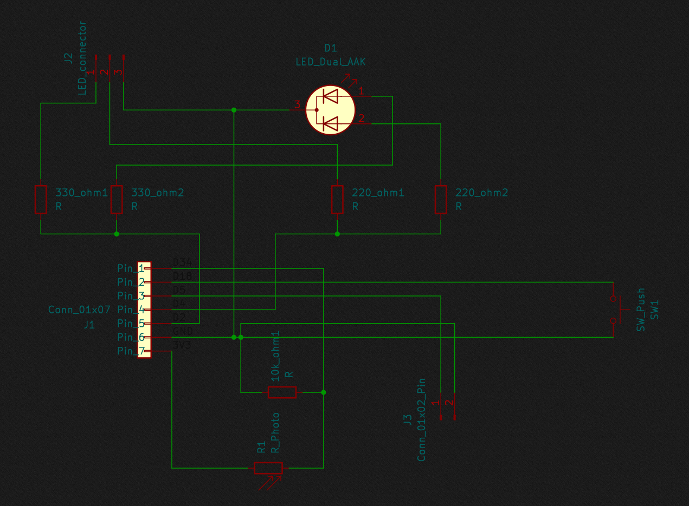

<br>

### 📐 Electronics Layout (Raw KiCad PCB)
The custom board features a compact form factor, dedicated mounting holes, and clear silkscreen labeling.

| Front Layout | Back Layout |
| :---: | :---: |
| 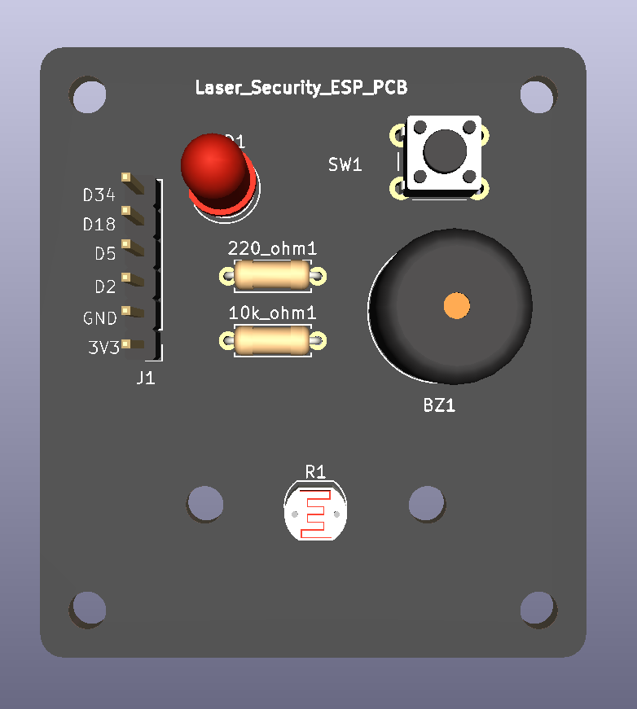 | 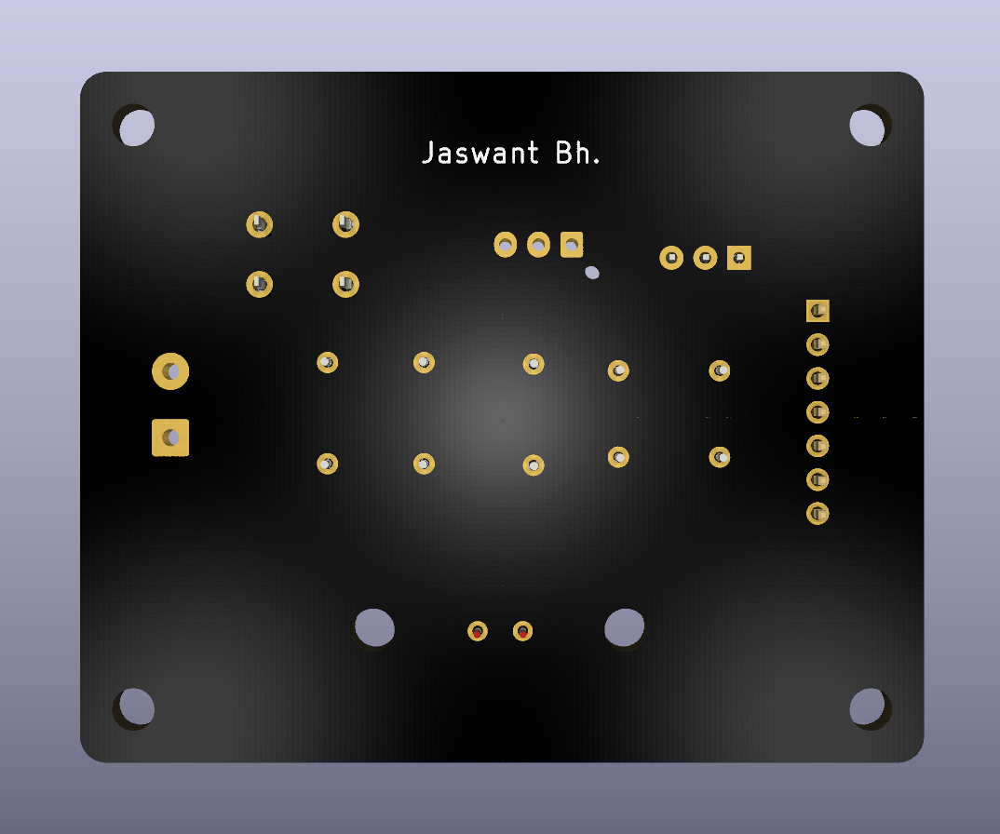 |

<br>

### <span id="mechanical"></span>⚙️ Standalone Mechanical Mount
To achieve complete optical isolation and filter out ambient environmental light, a custom-molded mounting shroud was engineered.
<details> 
<summary><b>Click to Expand | Standalone Shroud Views</b></summary>

<br>

| Isometric View | Front View | Back View |
| :---: | :---: | :---: |
| 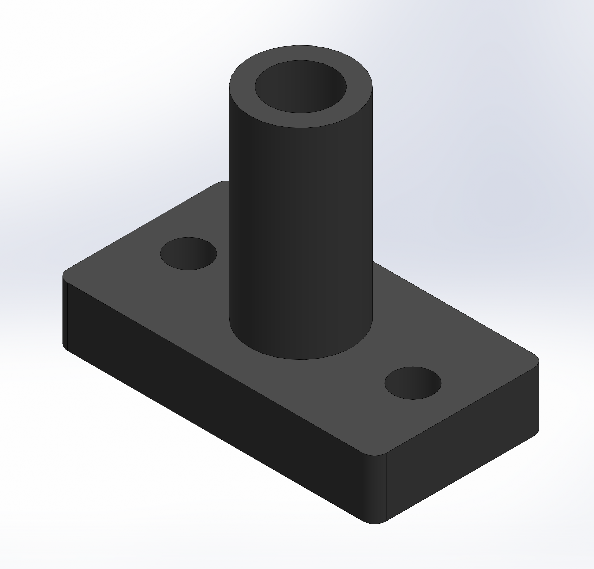 | 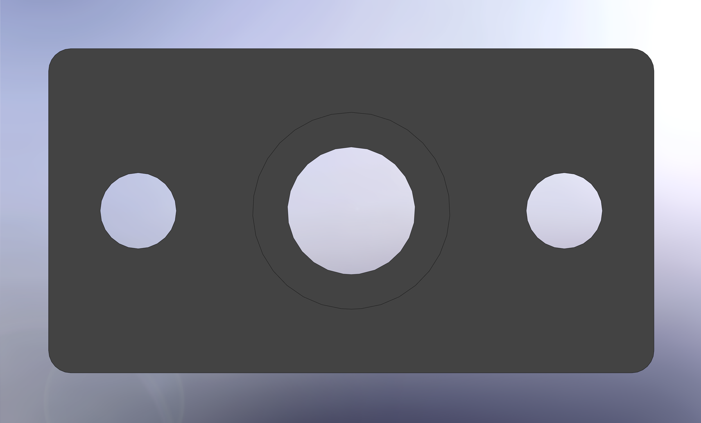 | 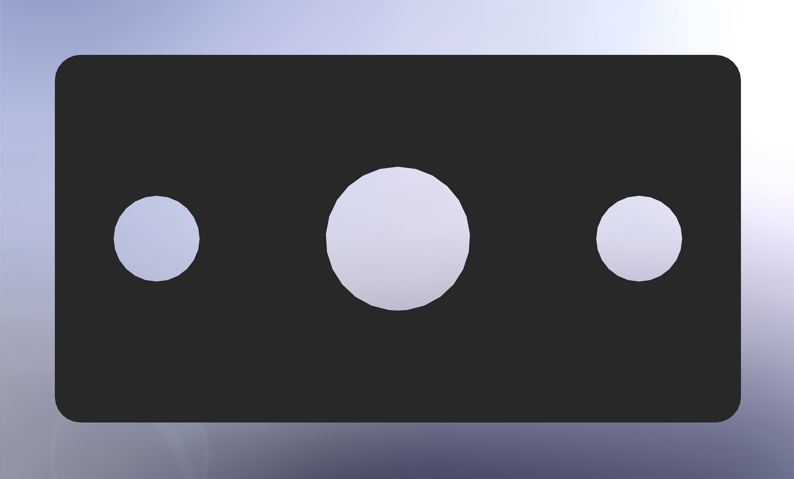 |

#### 📐 Engineering Dimensions & Tolerances
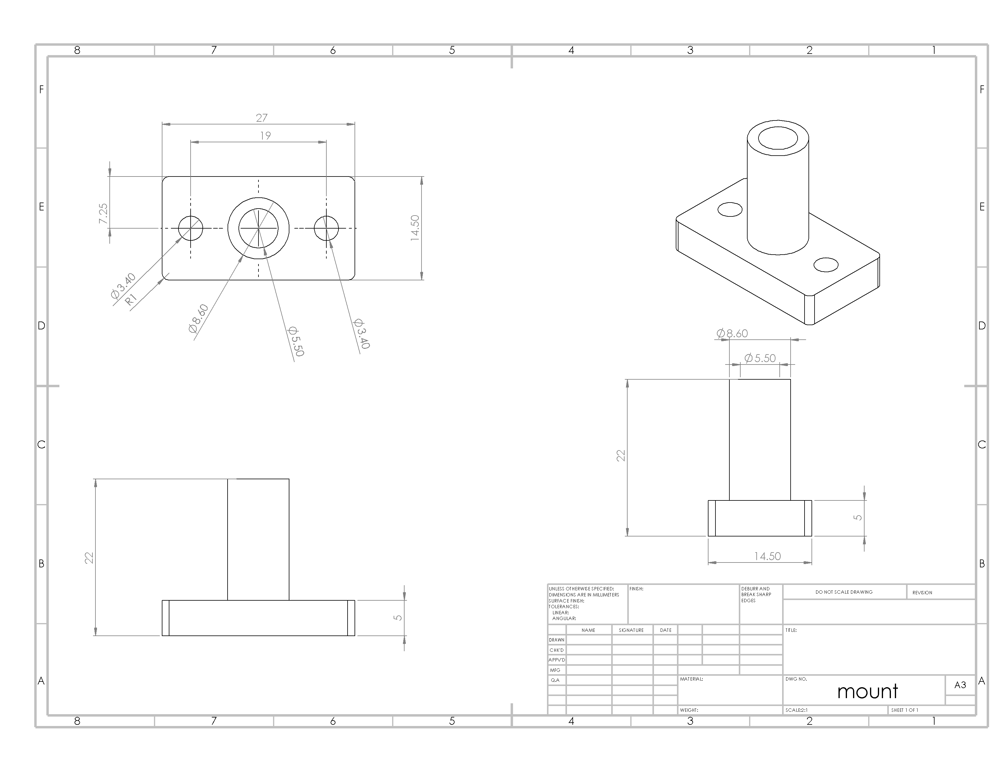

**Design Specifications:**

* **Material:** Matte/Satin Dark Grey PLA (To absorb stray internal reflections)
* **Internal Diameter:** Uniform 5.7mm corridor (Provides a 0.5mm clearance cushion for hand-soldered LDR play and FDM printing shrinkage)
* **Fasteners:** Dual M3 clearance holes for flush mounting.

</details>

<br>

👉 **[Click here to view the interactive 3D Mount Model Natively on GitHub](./production/3d_printing/mount.STL)**

<br>

### 🤝 Fully Integrated Assembly
The combined views show the mechanical shroud assembly bolted directly onto the electronic control circuit board.

<div align="center">
       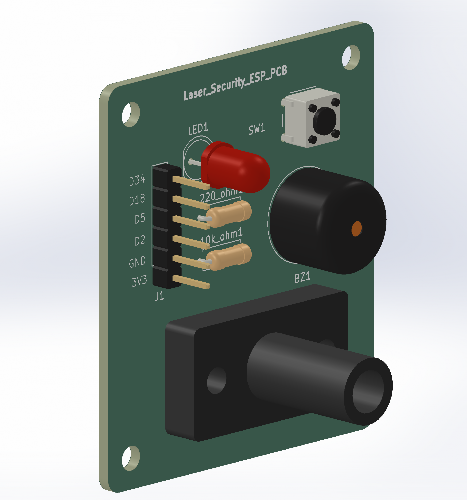
</div>

<br>
       
| Assembly Top View | Assembly Solder Side View |
| :---: | :---: |
| 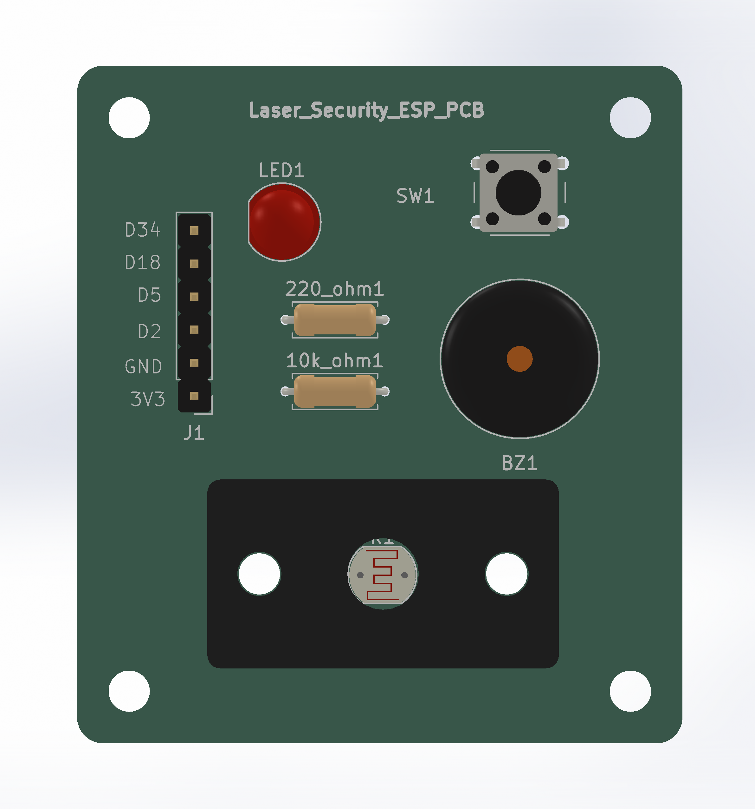 | 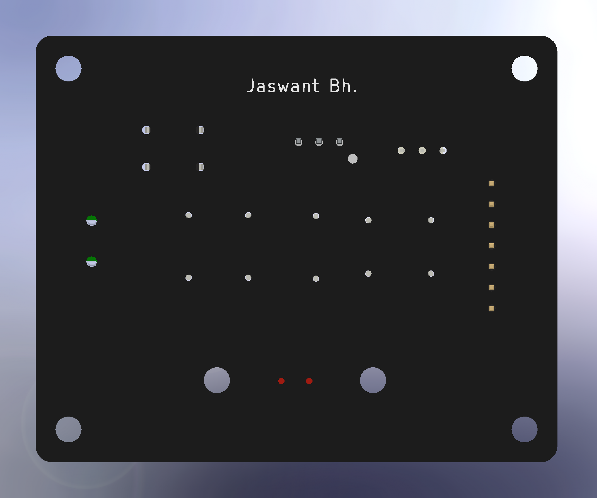 |

<br>

---

 
## 🔋 Power Setup

<details>
  
<summary><b>Click to Expand | Power Setup for two Paths</b></summary>

<br>

The system uses **two separate power paths** to stop electrical noise from the laser from messing with the ESP32 and sensors.


### ⚡ Path 1: ESP32 & Custom PCB
Powers the main controller and sensor board.

<div align="center">
       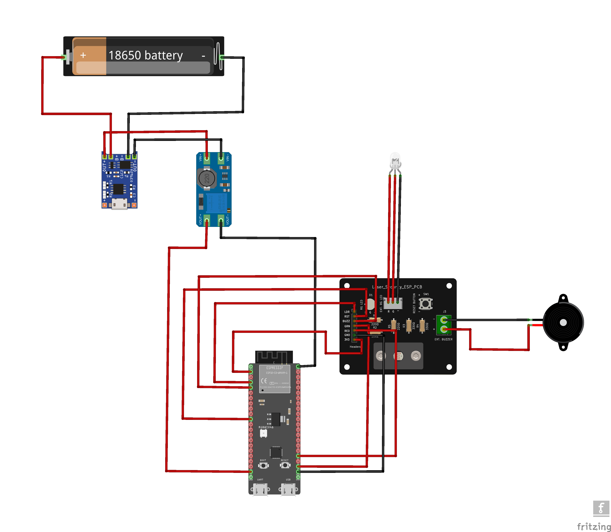
</div>

<br>

* **Battery (18650)** ➔ **TP4056 Charger** (Safe charging)
* **TP4056 Output** ➔ **Boost Converter** (Steps up voltage)
* **Boost Converter (5V)** ➔ **ESP32 Pin (5V)** (Powers MCU)
* **ESP32 Pin (3.3V)** ➔ **Custom PCB (J2)** (Powers LDR & LED)

<br>

### 🔦 Path 2: Standalone Laser Transmitter Node
Powers the laser module independently with zero physical connection to the main board.

<div align="center">
    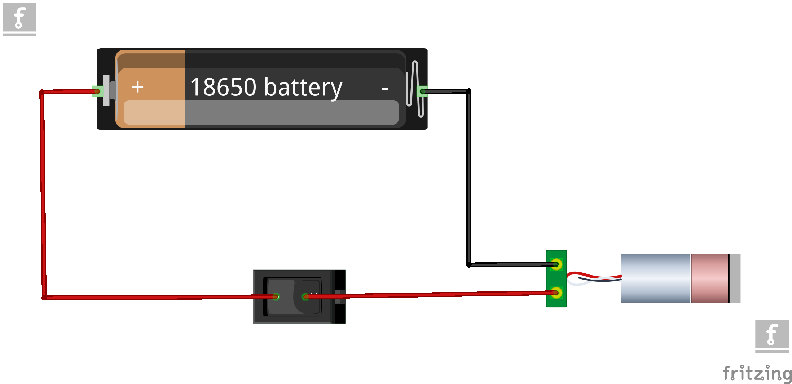
</div>

<br>

* **100% Isolated:** No shared wires or common ground loops with the ESP32-S3.
* **18650 Battery Powered:** Runs on its own 18650 cell (~3.7V) for maximum, long-lasting brightness.
* **Manual Switch Control:** Uses an inline rocker switch to completely cut power and save battery when off.

</details> 

<br>


---

## 📂 Repository Structure
``` yaml
      esp32-laser-security/
      ├── src/                             # 💻 Firmware Source Code (PlatformIO)
      │   ├── main.cpp                     #   └── Main security system logic
      │   └── testing/                     #   └── Isolated hardware testing scripts
      │       └── laser-connected-esp.cpp
      │
      ├── esp32-laser-security-pcb/        # 🛠️ KiCad Hardware Design Files
      │   ├── *.kicad_sch                  #   └── Circuit schematic
      │   └── *.kicad_pcb                  #   └── PCB routing layout
      │
      ├── production/                      # 📦 Manufacturing & 3D Printing Files
      │   ├── gerbers/                     #   └── PCB manufacturing files (Gerbers)
      │   ├── 3d_printing/                 #   └── 3D-printable mount shroud (.STL / .3MF)
      │   └── step_models/                 #   └── 3D CAD assembly model (.STEP)
      │
      ├── assets/                          # 🖼️ Documentation Media
      │   ├── circuit_schematic.png        #   └── Circuit diagram for README
      │   ├── pcb_raw_*.png/jpg            #   └── 3D images of unmounted PCB
      │   ├── mount_*.jpg                  #   └── 3D images of standalone plastic mount
      │   └── pcb_assembled_*.jpg          #   └── Photos of the final assembly
      │
      ├── platformio.ini                   # ⚙️ Project configuration & libraries
      └── README.md                        # 📖 Main project documentation guide
```
<br>

---

## 🛠️ Hardware Requirements

| Component | Quantity | Purpose |
| :--- | :--- | :--- |
| **ESP32-S3 DevKitC-1 N16R8** | 1 | Central processing unit & real-time monitoring engine |
| **SYD1230 650nm 5mW Red Laser Module** | 1 | Focusable transmitter node optimized for budget-friendly bouncing |
| **Light Dependent Resistor (LDR)** | 1 | High-sensitivity optical receiver |
| **SFM-27 Active Piezo Buzzer (Continuous Sound)** | 1 | 3–24V high-decibel audible indicator; allows the ESP32 to cleanly drive custom dual-frequency police siren sweeps without internal timing conflicts |
| **First-Surface Mirrors / HDD Platters** | 2–4 | Zero-ghosting high-reflectivity corner reflection nodes |
| **Metal Film Resistor (10 kΩ)** | 1 | Pull-down resistor for the analog voltage divider circuit |
| **Metal Film Resistor (330 Ω)** | 2 | Current-limiting protection resistors (e.g., for status LEDs) |
| **Metal Film Resistor (220 Ω)** | 2 | Current-limiting protection resistors (e.g., for buzzer power constraints) |
| **6x6x5mm Tactile Push Button Switch** | 1 | PCB-mount tactile switch for instant manual system reset or calibration |
| **7×1 Pin Male Berg Header (Straight, 10mm Height, 2.54mm Pitch)** | 1 | Breakout interface connector for peripheral GPIO programming/debugging pins |
| **XY126V-5.0-2P Green Screw Terminal Block (5mm Pitch, Through Hole)** | 1 | XINLAIYA 10A 300V power connector with wire protection for external main DC input |
| **3 Pin JST XH 2.5mm Top Entry Header (Straight Male & Female Pair)** | 1 | Polarity-keyed locking connector for secure LDR receiver wire routing |
| **Socket Head Cap Screw (M3x12)** | 2 | High-strength mechanical fasteners for enclosure or PCB corner mounting |
| **M3 Stainless Steel Hex Nut** | 2 | Matching rust-resistant hexagonal nuts to secure the M3 mounting screws safely |

<br>

---

## 🔌 Circuit Topology & Wiring

To achieve a clean optical baseline and prevent room lighting from flooding the sensor, the LDR must be housed inside an opaque, dark isolation tube pointed directly down the incoming laser path.

### Central Control Unit Pinout Mapping

```text
      +-----------------------------------------------------------------+
      |                    ESP32-S3 DevKitC-1 N16R8                     |
      +-----------------------------------------------------------------+
        | GPIO 4 (ADC) | <-------> Pin 1: LDR  (R1 Sensor Output Node)
        | GPIO 18       | <-------- Pin 2: RST  (Reset Push Button SW1)
        | GPIO 5        | --------> Pin 3: BUZZ (External Buzzer J3)
        | GPIO 19*      | --------> Pin 4: GRN  (Green LED Control Rail)
        | GPIO 21*      | --------> Pin 5: RED  (Red LED Control Rail)
        | GND           | --------> Pin 6: GND  (Common System Ground)
        | 3V3           | --------> Pin 7: 3V3  (System Power Input)

```
``` text
        +-----------------------------------------------------------------------------------+
        |                            EXTERNAL COMPONENT CONNECTIONS                         |
        +-----------------------------------------------------------------------------------+
        |                                                                                   |
        |  [ PCB Header J1 ] --------------------> Connects to EXTERNAL RG LED              |
        |     (EXT. RG LED)                         - Pin R: Red Indicator Anode            |
        |                                           - Pin G: Green Indicator Anode          |
        |                                           - Pin -: Common Ground Rail             |
        |                                                                                   |
        |  [ PCB Header J3 ] --------------------> Connects to EXTERNAL ACTIVE BUZZER       |
        |     (EXT. BUZZER)                         - Pin +: Positive Audio Signal Input    |
        |                                           - Pin -: Negative Ground Return         |
        |                                                                                   |
        +-----------------------------------------------------------------------------------+

```


### 3.3V Safe Voltage Divider Layout

```text
3V3 Rail -----[ LDR ]-----+-----> GPIO 34 (Analog Read Input)
                          |
                     [ 10kΩ Resistor ]
                          |
                         GND Rail
```
_Note: Powering the LDR network from the 3V3 rail protects the ESP32's 12-bit ADC pins from 5V over-voltage degradation._

<br>

---

## 💻 Software Configuration & Installation

This project is built using PlatformIO IDE inside VS Code for robust environment management and smaller, compiled binary footprints.
### Project Environment Configuration (platformio.ini)

```Ini, TOML

[env:esp32-s3-devkitc-1]
platform = espressif32
board = esp32-s3-devkitc-1
framework = arduino
monitor_speed = 115200

# Force the compiler to disable PSRAM tracking to prevent boot panics
build_flags = 
    -DBOARD_HAS_PSRAM=0
    -DARDUINO_USB_CDC_ON_BOOT=1

# Specify LittleFS partitioning layout
board_build.filesystem = littlefs

# Standard partition table for an 8MB Flash device (No PSRAM)
board_build.partitions = default_8MB.csv

lib_deps =
    esphome/ESPAsyncWebServer-esphome @ ^3.2.2
    knolleary/PubSubClient @ ^2.8

# Tell PlatformIO to compile everything in src, EXCEPT the testing folder
build_src_filter = +<*> -<testing/>

```
<br>

### Deployment Instructions

1. Clone this repository to your local workspace:
    ```Bash
    git clone https://github.com/JaswantBhartiya/esp32-laser-security.git
    ```
    
2. Open the project folder directly inside **Visual Studio Code** with the **PlatformIO** extension active.

3. Align your external laser node across your mirror grid so it hits the center of the LDR tube.

4. Click the **PlatformIO**: **Upload** arrow icon on the bottom status bar (or press (`Ctrl + Alt + U`) to compile and flash the firmware.

5. Open the **Serial Monitor** (`Ctrl + Alt + M`) at `115200` baud to watch the system run its initial calibration profiling.
<br><br>

---

## ⚙️ How System States Work

```text
  
           +------------------+
           | STATE_CALIBRATING| <-------- On Boot / User Reset
           +------------------+
                     |
                     v (Samples light & computes threshold)
           +------------------+
      +--->|   STATE_ARMED    |
      |    +------------------+
      |              |
      |              v (Beam broken for >50ms)
      |    +------------------+
      |    |  STATE_BREACHED  |
      |    +------------------+
      |              |
      +--------------+ (Reset Button Pressed)

```

* **Boot Calibration:** Samples the laser beam for 3 seconds to calculate a dynamic trigger threshold between direct laser light and ambient room light.
* **Active Guard:** Continuously samples the LDR. Requires the beam to be broken for over `50ms` to filter out false alarms from dust or bugs.
* **Breached Alert:** Plays a dual-tone siren sweep ($800\text{Hz}$ to $1300\text{Hz}$) on `GPIO 5` using non-blocking microsecond delays.
* **Hardware Reset:** Actively polls `GPIO 18`. Pressing the reset button instantly mutes the buzzer and recalibrates the system back to Armed mode.

<br>

---

## ⚙️ Calibration & Environment Tuning

### 🛠️ Quick Alignment Guide

1. **Align:** Aim the laser dot directly into the center of the LDR shroud.
2. **Calibrate:** Power on or reset the ESP32. Keep the laser path completely clear for the first **3 seconds**.
3. **Calculate:** The firmware auto-sets the trigger threshold using a simple median formula:

$$\text{Threshold} = \frac{\text{Laser Intensity} + \text{Ambient Light}}{2}$$

4. **Verify:** Block the beam with your hand to test that it instantly triggers the alarm.

<br>

### 🔍 Ambient Light Troubleshooting

| Issue | Root Cause | Quick Fix |
| :--- | :--- | :--- |
| **Instant alarm on boot** | Laser missed the LDR during calibration. | Re-align the laser and press the reset button to recalibrate. |
| **Beam broken, no alarm** | Side-glare or ambient room light is bleeding into the sensor. | Move away from windows or use a longer 3D-printed shroud to block ambient light. |
| **Siren flickers/jitters** | Laser dot is slightly misaligned or vibrating on the edge of the sensor. | Tighten your laser/mirror mounts to eliminate physical jitter. |

<br>

---

## 🚀 Hardware Evolution & Development
To see the complete multi-phase development timeline—including planned v2.0 hardware protection circuits, v3.0 wireless IoT feature tracking, and long-term mechanical upgrades—view the project's growth pipeline:

👉 **[View the Comprehensive Project Roadmap & Future Upgrades](./HARDWARE_ROADMAP.md)**

<br>

---

## 📄 License

This project is licensed under the MIT License - see the [`LICENSE`](./LICENSE) file for details.
